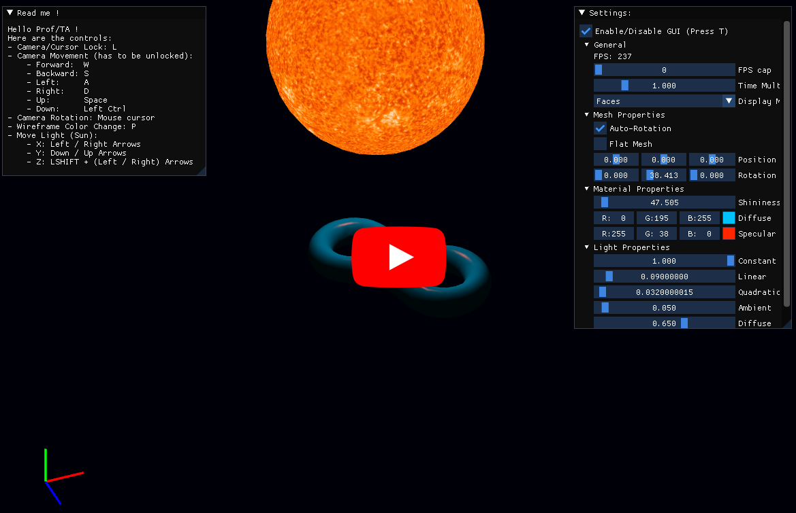

# Assignment 6 of Fundamentals of Computer Graphics: Illumination Effect

    

# Introduction

For this assignment, the main theme was `Bezier Surfaces`.

The objectives here were:

1) Use 25 (5 x 5) control points

2) Use subdivision control shader TCS to set subdivision level

3) Using subdivision control shader TES to calculate new vertex coordinates and texture

coordinates according to the mathematical equation of Bezier surface

4) Change smoothness of the surface by keyboard

5) Support wireframe mode display.

6) Add texture to Bezier surface. Choose the texture by yourself.

# Compilation

This project and all of my CG projects will be compiled with CMake, if you open the project directly with Visual Studio, you should be able to directly compile it.
Though, as CMake permits it, you will be easily able to compile on other platforms.

# Demonstration

## Content

For my Assignment, I got all these points covered:

- Bezier Surface with 25 control points
- Use of TCS & TES shaders
- Change Smoothness by keyboard but also GUI
- Wireframe mode
- Texture used on the Bezier Surface
- Bonus:
    - Display Mode (Vertices, Wireframe, Faces)
    - Enable/Disable GUI
    - Particle Systems parameters can be edited

## How to use it

You can launch the `Assignment5.exe`directly, if you already have Visual C++ Redistribuable.

The program was compiled in Release mode.

As it is displayed in the program, here are the controls by order of priority for the assignment:

## Controls

- Enable/Disable GUI: T
- Wireframe Color Change: P
- Camera/Cursor Lock: L
- Change Display Mode: C
- Change Smoothness: ⬅️➡️
- Camera Movement:
    - Forward: W (or Z on AZERTY layout)
    - Backward: S
    - Left: A (or Q on AZERTY layout)
    - Right: D
    - Up: Space
    - Down: Left CTRL

## Additional Interactions

- You can change the Display Mode on the `Display Mode`menu.
- You can change the FPS cap/limit
- You can set/unset Auto-Rotation
- You can change the Time multiplier (multiplies deltaTime)

# Code Architecture

The Complete Documentation is available in the project, in the Code Architecture part will only be explained a small description of what classes do.

## Documentation

There is a documentation available [here](https://kevinpruvost.github.io/ComputerGraphics_Assignment6/) or in `docs/index.html` if you want to have a better view on the classes I made.
